<h4 align="center">仿小米商城</h4>

	</a>
        
	</a>
        
	
	
	
	
	
	
	
	
	
	
	
	
	
	

#### 介绍

此项目参用b2c商城模式，使用SpringBoot +SpringCloud + Vue进行前后端分离

#### 软件架构
B/S架构，采用前后端分离技术

#### 安装教程

1. Java项目全部一键启动  

2. 前端项目下载依赖 npm install

3. 前台启动 npm run serve

4. 将sql目录下的sql文件导入mysql数据库中

#### 技术介绍

前端技术：Vue2 + Vuex + Vue - Router + Axios + Element - ui + JavaScript + LayuiAdmin

后端技术：SpringBoot + SpringBootAdmin + MyBatisPlus + MySQL+ Redis + Swagger + Druid + ElasticSearch + Ra
bbitMQ + OSS + Nacos + OpenFegin + Gateway

* 整体架构采用b2c商城模式

* 使用QQ邮箱进行验证

* 接入支付宝沙箱支付，完成支付功能

* 使用Nacos作为服务注册中心和配置中心

* 使用GateWay进行统一网关处理，进行动态路径转发

* 使用OpenFegin进行远程调用服务

* 使用ElasticSearch进行全文商品搜索，提高检索速度

* 图片上传至阿里云OSS服务

* 使用RabbitMQ保证MySQL数据库和ElasticSearch搜索引擎的数据同步

* Swagger生成接口文档

* 使用Redis整合SpringCache进行缓存，提高访问效率

* ES中数据展示
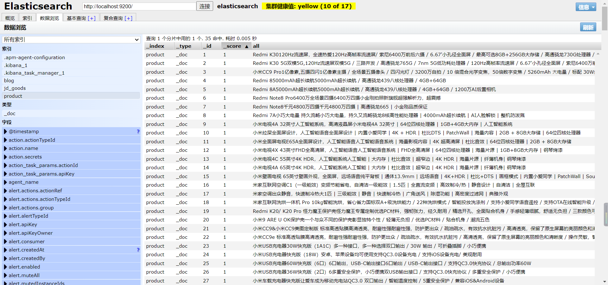

* 使用SpringBootAdmin实时监控微服务
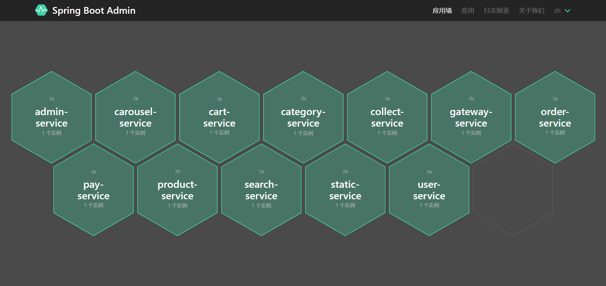

#### 前台效果图

* 电商前台首页-轮播图
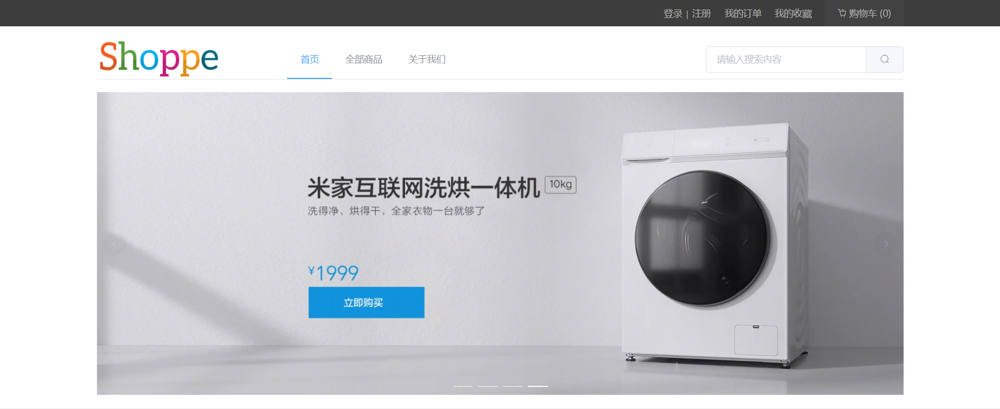

* 电商前台首页-手机
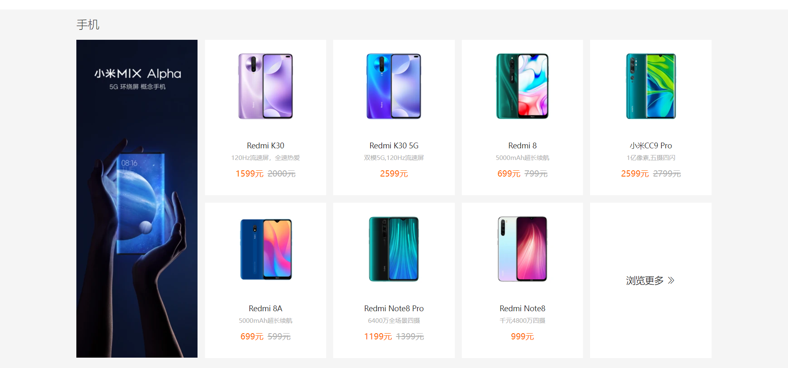

* 电商前台首页-家电
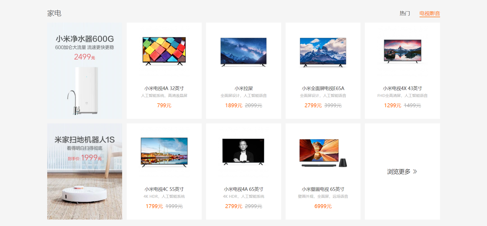

* 电商前台首页-配件
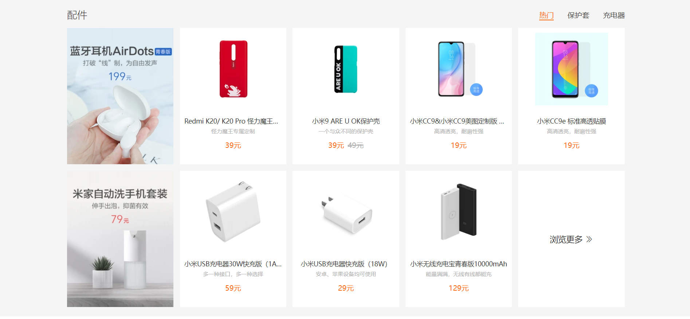

* 电商前台全部商品
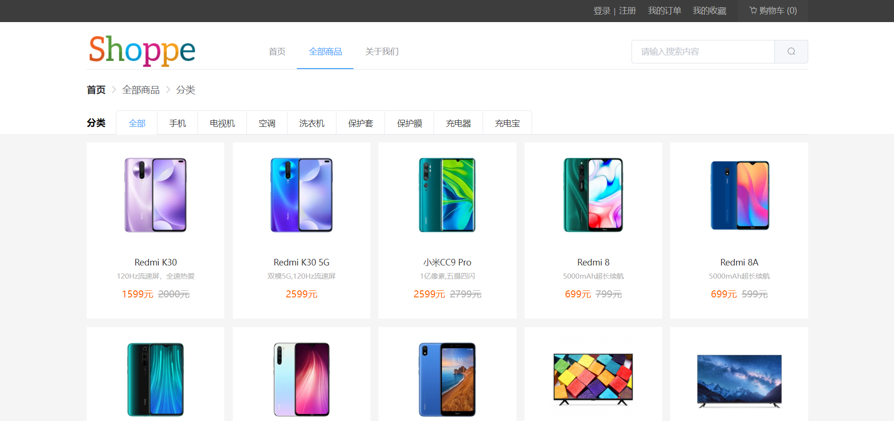

* 购物车
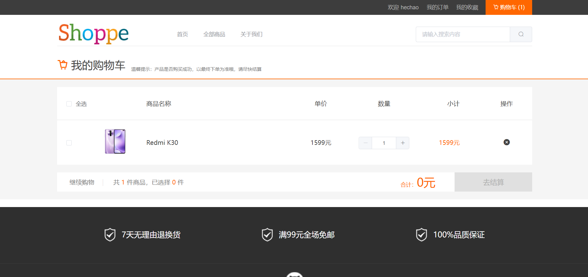

* 我的订单
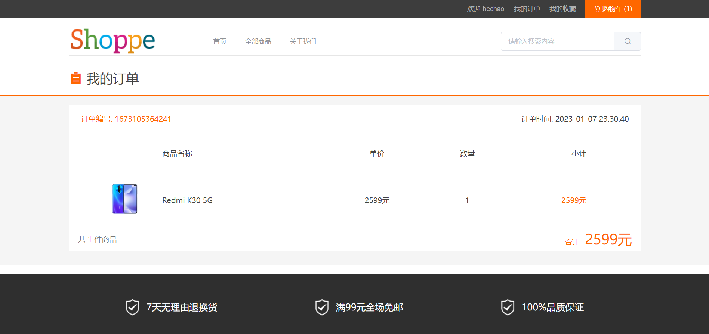

#### 后台管理效果

* 用户管理
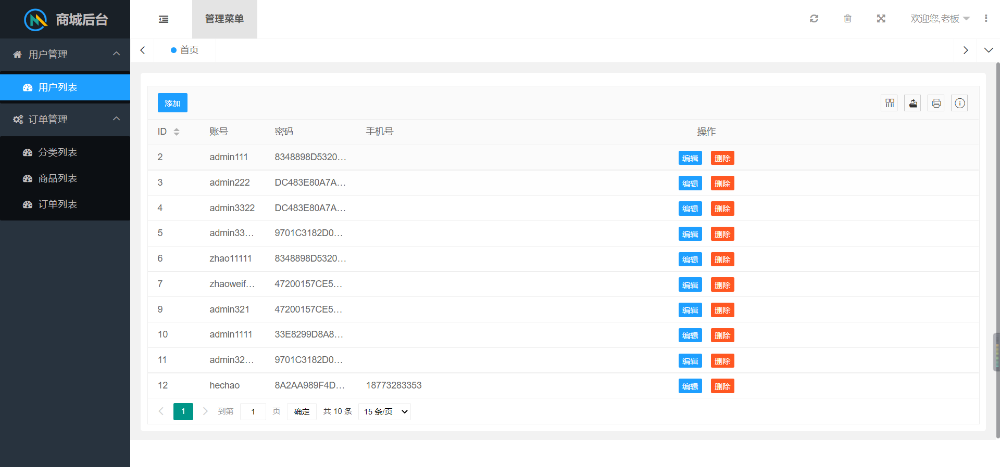

* 分类管理
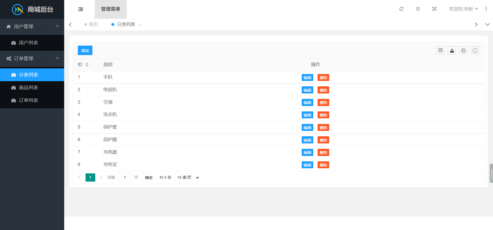

* 商品管理
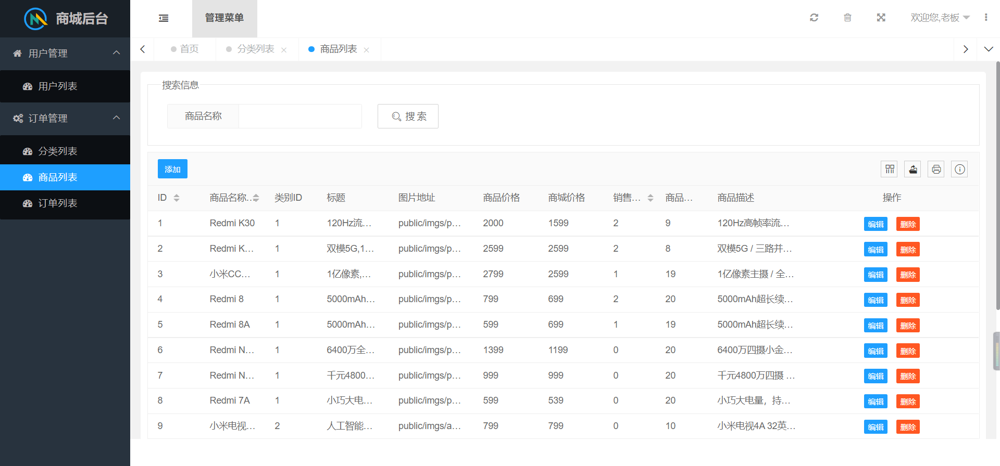

* 订单管理
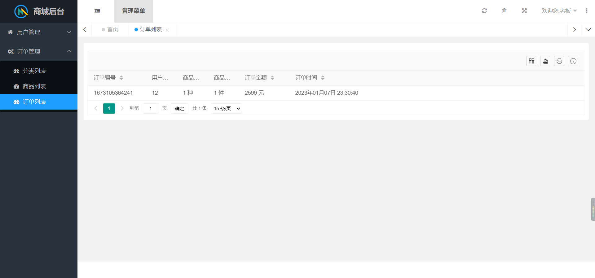

#### 可加QQ询问

QQ：2740860037
